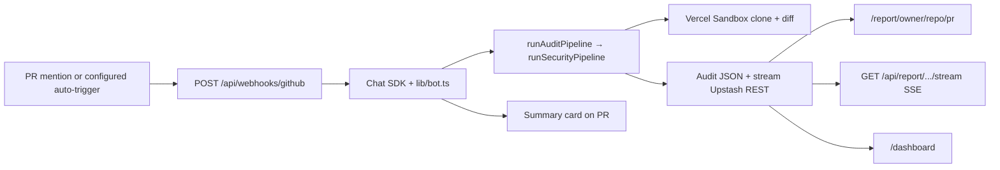
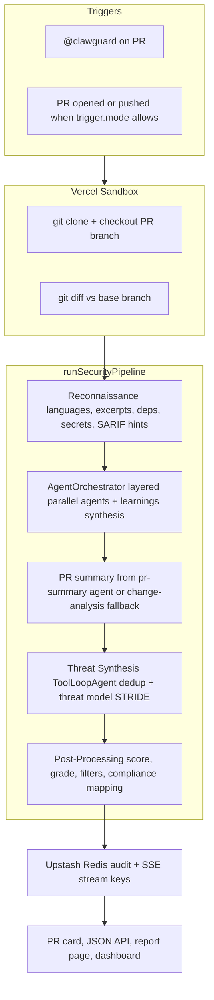
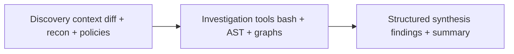
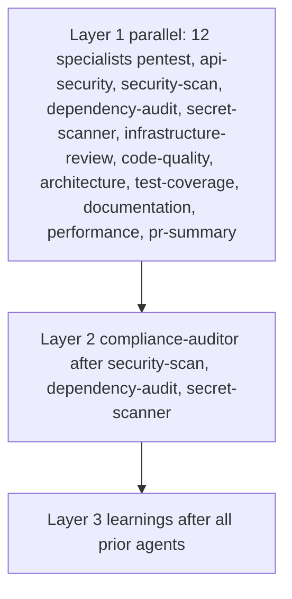
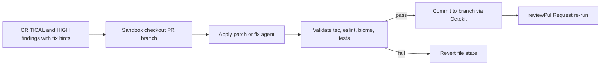

<h1 align="center">ClawGuard</h1>

<p align="center">
  <strong>AI-powered security agent that audits GitHub PRs, finds vulnerabilities, auto-fixes them, and generates interactive reports</strong>
</p>

<!-- Hero screenshot: summary card + report page -->
<!-- Demo GIF: optional assets/demo.gif -->

<p align="center">
  <a href="https://github.com/Julian-AT/clawguard"></a>
  
  
  
  
</p>

## Overview

ClawGuard is a single [Next.js](https://nextjs.org/) deployment on Vercel. A GitHub App webhook receives PR events; the [Chat SDK](https://chat-sdk.dev) GitHub adapter drives the thread. Analysis runs inside an isolated [Vercel Sandbox](https://vercel.com/docs/vercel-sandbox): clone, diff, reconnaissance, then a **multi-agent** security review coordinated by [`AgentOrchestrator`](lib/agents/orchestrator.ts), followed by threat synthesis and scoring.

Structured audit JSON is stored in Upstash Redis. The bot posts a JSX summary card and links to a full report. Critical and high findings can be fixed in the sandbox, validated, and committed back to the PR branch, with re-audit to close the loop.

**Three surfaces:**

1. **GitHub PR thread** — @mention `@clawguard`, summary card, fix/re-audit commands.
2. **Interactive report** — `/report/[owner]/[repo]/[pr]` (and `/report/demo` without Redis).
3. **Dashboard** — NextAuth GitHub OAuth, repos with audits, trends, learnings, tracking.

Unlike static linters alone, ClawGuard reasons over the changed tree with tools in a real checkout, runs specialized agents in parallel where dependencies allow, synthesizes a threat model, and can apply fixes with a validation gate—not only flag lines.

## The problem

Traditional SAST and secret scanners excel at fast, rule-based signals but often miss context across files, abuse scenarios, and architectural boundaries. Security reviews that stay in comments rarely ship patches. ClawGuard targets the gap between **detection** and **remediation**: one agentic path from PR event to stored audit, human-readable report, and optional autonomous fix plus re-audit.

## Core features

### Security analysis

- Isolated clone and diff in Vercel Sandbox; recon pass over changed files and repo context.
- **Multi-agent scan**: [`AgentOrchestrator`](lib/agents/orchestrator.ts) runs registered agents in topological layers (parallel within a layer, ordered by `dependsOn`). Each agent is a Vercel AI SDK `ToolLoopAgent` with structured Zod output, `bash-tool` and optional Claw tools (`parse_diff`, `ast_analyze`, `dependency_graph`, etc.) inside the sandbox.
- Optional agents can be disabled via config (e.g. dependency audit, secret scan).
- After orchestration, **threat synthesis** deduplicates and builds the executive threat model; **post-processing** applies score, grade, filters, and compliance normalization.
- Findings carry CWE, OWASP categories, optional STRIDE, data-flow notes, and Mermaid where generated.
- Compliance-style mapping for frameworks such as PCI-DSS, SOC2, HIPAA, NIST, and OWASP ASVS when present on findings.

### Auto-fix

- Deterministic application of `fix.before` / `fix.after` when available; LLM fix agent with the same bash tool surface as a fallback.
- Validation gate before any commit (TypeScript, ESLint, Biome, tests when present); batch commits when configured.
- Re-audit after successful fixes to refresh the stored audit and thread summary.

### Interactive reports

- Score gauge (Recharts), severity breakdown, OWASP distribution chart.
- Tabs: Findings (search, filter, accordions), PR Summary (narrative, sequence diagrams), Threat Model (risk, boundaries, attack paths), Compliance (tabular mapping).
- Shiki-highlighted code and side-by-side diffs; Mermaid rendered client-side.
- Live processing via stream events and polling (`GET /api/report/.../stream`).

### PR integration

- Chat SDK JSX card: severity counts, top findings table, **Fix All**, **Re-audit**, **View full report**.
- Comment commands: `fix all`, `fix <type>`, `re-audit` / `scan` / `review` style triggers; optional LLM intent classification when heuristics do not match.
- Configurable trigger mode (mention-only, automatic, or both), draft and label ignores, cooldown between runs.
- Feedback phrases in comments can be captured as learnings for future scans.

### Dashboard and product surfaces

- GitHub sign-in; org-level list of repos that have audits; per-repo history with latest score/grade and optional trend line when multiple audits exist.
- Routes for org learnings, repo learnings, org knowledge injection, and post-merge tracking metrics per repo.

### Post-merge tracking

- Correlates audit predictions with later issue activity where configured; surfaces precision-oriented metrics on the tracking dashboard.

### Multi-platform

- Webhook routes for Slack, Teams, and Linear via shared Chat SDK wiring; optional env vars in `.env.example`. Discord is documented as a sidecar (native deps not bundled).

### Configuration

- Target **audited** repo files: `.clawguard/config.yml` for thresholds, model, scanning depth, triggers, autofix, analysis toggles, learnings, tracking; `.clawguard/policies.yml` for extra policy rules merged into specialist prompts.
- Defaults live in [`lib/config/defaults.ts`](lib/config/defaults.ts). Full option layout: [`clawguard-plan.md`](clawguard-plan.md).

## System architecture

Everything runs in one deployment: webhook handlers, the Chat SDK bot, the audit pipeline, Redis-backed storage, report API routes, and the dashboard share the same Next.js app and env. No separate backend service is required for the core loop.



## Agent pipeline

Production flow is implemented in [`lib/analysis/pipeline.ts`](lib/analysis/pipeline.ts): **recon** → **`AgentOrchestrator.run`** (multi-agent scan with shared sandbox and recon context) → optional **PR summary** resolution from the `pr-summary` agent or [`runChangeAnalysis`](lib/analysis/change-analysis.ts) fallback → **`runThreatSynthesis`** (`ToolLoopAgent`, structured output) → **`postProcessAudit`** (scoring, grading, filters).



### Agent runtime model

- **Tool-driven loops**: each specialist agent uses `ToolLoopAgent` with `stopWhen: stepCountIs(maxSteps)` (capped per agent and by `config.scanning.maxSteps`).
- **Structured output**: `Output.object({ schema })` with Zod (`FindingSchema`, `PRSummarySchema`, etc.) so downstream post-processing stays typed.
- **Skills injection**: repo-relative skill packs are merged into instructions via [`injectSkills`](lib/skills) per agent name.
- **Streaming and observability**: `onStepFinish` hooks (`createOnStepFinish`) and `onStreamEvent` / `onAgentStep` callbacks feed Redis-backed SSE for the report UI.



### Orchestrator architecture

[`lib/agents/orchestrator.ts`](lib/agents/orchestrator.ts) builds **execution layers** with a topological sort over `dependsOn`. Agents with no unresolved dependencies start together; each layer runs **`Promise.all`** over its agents. **Compliance auditor** waits for `security-scan`, `dependency-audit`, and `secret-scanner`. **Learnings** waits for every other registered agent (including `pr-summary` and `compliance-auditor`) so it can merge, suppress per learnings, emit a review verdict, and optionally replace the finding list with `finalFindings`.

[`lib/agents/registry.ts`](lib/agents/registry.ts) holds definitions registered from [`lib/agents/definitions/`](lib/agents/definitions/) (side-effect imports in [`index.ts`](lib/agents/definitions/index.ts)).



### Agent system deep dive

#### Security and offensive reasoning

1. **`security-scan`** ([`security-scan.ts`](lib/agents/definitions/security-scan.ts)) — Principal AppSec pass on code-level issues in the diff: CWE, OWASP, data-flow nodes, optional Mermaid, `fix.before`/`fix.after`, policy alignment. Skips duplicate work owned by dependency, secret, or pure infra agents.

2. **`pentest`** ([`pentest.ts`](lib/agents/definitions/pentest.ts)) — Round-based offensive reasoning: attack surface, entry points, conditional exploitability narratives (no live-exploit claims).

3. **`api-security`** ([`api-security.ts`](lib/agents/definitions/api-security.ts)) — HTTP/API routes and handlers: auth, sessions, rate limits, validation, CORS, error leakage, IDOR, CSRF where relevant. Skips when the PR does not touch API code.

4. **`secret-scanner`** ([`secret-scanner.ts`](lib/agents/definitions/secret-scanner.ts)) — Secrets on added lines, provider-style patterns, entropy, `.gitignore` coverage; can read config when needed.

#### Supply chain and platform

5. **`dependency-audit`** ([`dependency-audit.ts`](lib/agents/definitions/dependency-audit.ts)) — Runs `npm audit` / equivalent in the sandbox, interprets CVEs, risky versions, and license notes using recon hints.

6. **`infrastructure-review`** ([`infrastructure-review.ts`](lib/agents/definitions/infrastructure-review.ts)) — Docker, K8s/Helm, Terraform, CI workflows: misconfigs, privilege, secrets in layers, weak IAM patterns.

7. **`compliance-auditor`** ([`compliance-auditor.ts`](lib/agents/definitions/compliance-auditor.ts)) — Maps **prior** findings to PCI-DSS, SOC 2, HIPAA, NIST 800-53, OWASP ASVS; runs after the core scanners it depends on.

#### Quality and structure

8. **`code-quality`** ([`code-quality.ts`](lib/agents/definitions/code-quality.ts)) — AST-backed smells, complexity, refactor suggestions via merged bash + Claw tools (`parse_diff`, `ast_analyze`, `dependency_graph`).

9. **`architecture`** ([`architecture.ts`](lib/agents/definitions/architecture.ts)) — Coupling, circular imports, blast radius, Mermaid via `dependency_graph` / `generate_diagram`.

10. **`test-coverage`** ([`test-coverage.ts`](lib/agents/definitions/test-coverage.ts)) — Maps changed logic to tests; suggests cases and notes drift.

11. **`documentation`** ([`documentation.ts`](lib/agents/definitions/documentation.ts)) — Public API doc gaps, stale comments, changelog-worthy changes.

12. **`performance`** ([`performance.ts`](lib/agents/definitions/performance.ts)) — N+1, blocking async, unbounded work, heavy imports; may use `semgrep_scan` where configured.

#### Narrative and consolidation

13. **`pr-summary`** ([`pr-summary.ts`](lib/agents/definitions/pr-summary.ts)) — Structured `PRSummary` (narrative, sequence diagrams, complexity, breaking changes) plus walkthrough notes; findings array is empty; metadata feeds the report when `generatePRSummary` is enabled.

14. **`learnings`** ([`learnings.ts`](lib/agents/definitions/learnings.ts)) — Single `generateObject` step after all other agents: applies learnings suppressions, `teamPatterns`, `ReviewVerdictResult`, and **`finalFindings`** used by threat synthesis when present.

### Why these agents are not generic wrappers

- **Domain-constrained**: each agent has its own instructions, skill packs, max steps, and tool surface (bash-only vs bash + Claw tools).
- **Workflow-aware**: `dependsOn` enforces ordering (e.g. compliance after core scans; learnings last).
- **Parallel where safe**: independent agents share a layer and run concurrently to reduce wall-clock time.
- **Artifact-native**: stream events (`agent:started`, `finding:discovered`, etc.) tie into the live report UX.
- **Stateful at the pipeline level**: merged findings flow through `PipelineMemory` inside the orchestrator run; Redis stores the final audit for the dashboard and PR thread.

### Reliability, safety, and observability

- **Webhook idempotency**: `x-github-delivery` deduplication via Upstash keys before heavy work.
- **Schema validation**: Zod at API boundaries and for audit payloads (`AuditResultSchema`, etc.).
- **Isolation**: sandboxed git checkout and command execution for analysis and fixes.
- **Rate limits and cooldowns**: audit pipeline and auto-trigger helpers reduce runaway loops (see [`lib/github-audit-runner.ts`](lib/github-audit-runner.ts), [`lib/auto-trigger-redis.ts`](lib/auto-trigger-redis.ts)).
- **Partial failure**: orchestrator records per-agent errors; aggregate scan marks partial failure when any agent fails.
- **Logging**: structured audit logging and agent error handling via [`handleError`](lib/error-handler.ts) on agent failures.

## Auto-fix loop

Critical and high findings can be fixed from the thread (`@clawguard fix all`, `@clawguard fix <type>`, or card buttons). Fixes apply in a fresh sandbox, prefer stored before/after snippets, fall back to a dedicated fix `ToolLoopAgent` when needed, then run validation. Successful changes are committed to the PR branch via the GitHub API; the pipeline can run again to re-audit.



## How it works

### End-to-end request flow

1. Configure a GitHub App whose webhook targets `POST /api/webhooks/github`.
2. On mention or configured auto-trigger, the adapter delivers the event; [`lib/bot.ts`](lib/bot.ts) routes intents (audit, fix, re-audit).
3. [`runAuditPipeline`](lib/github-audit-runner.ts) invokes [`runSecurityPipeline`](lib/analysis/pipeline.ts) with a sandbox checkout of the PR branch.
4. Progress and final [`AuditData`](lib/redis.ts) are written under `{owner}/{repo}/pr/{number}` in Upstash REST; stream keys back SSE for the report UI.
5. The bot posts a JSX summary card; users open `/report/[owner]/[repo]/[pr]` for the full interactive view. The dashboard reads the same keys for history and trends.

### Pipeline stages (summary)

| Stage | Role |
|-------|------|
| Recon | Languages, excerpts, deps, secrets, SARIF hints over the change set |
| Multi-agent scan | `AgentOrchestrator` runs registered agents in layers; learnings agent may output `finalFindings` and verdict |
| PR summary | From `pr-summary` agent metadata or `runChangeAnalysis` when enabled |
| Threat synthesis | Dedup, STRIDE-oriented narrative, executive-style summary |
| Post-processing | Score 0–100, letter grade, ignore paths, compliance tags |

## Why this matters

Shipping fixes matters as much as finding issues. ClawGuard ties GitHub-native workflow, isolated analysis, and optional autonomous commits so teams can move from **comment** to **merged patch** without switching tools.

## Technology stack

| Layer | Packages / notes |
|-------|------------------|
| App | Next.js 16.2.1 (App Router), React 19.2.4, TypeScript 5.x |
| Styling | Tailwind CSS 4.2.2, shadcn/ui, `tailwind-merge`, `class-variance-authority` |
| AI | `ai` 6.0.141 (Vercel AI SDK, `ToolLoopAgent`, `generateObject`), models via Vercel AI Gateway |
| Bot | `chat` 4.23.0, `@chat-adapter/github`, `@chat-adapter/state-redis` |
| Sandbox & tools | `@vercel/sandbox` 1.9.0, `bash-tool` 1.3.15 |
| GitHub | `@octokit/rest` 22.0.1 |
| Data | `@upstash/redis` 1.37.0 (audits); TCP `REDIS_URL` for Chat SDK state |
| Auth | `next-auth` 4.24.13, `@auth/core` 0.34.3 |
| Report UI | Recharts, Mermaid, Shiki, `react-diff-viewer-continued`, `@v0-sdk/react` (v0-generated UIs) |
| Config & validation | `yaml` 2.8.3, `zod` 4.3.6 |
| Quality | Biome, Vitest |

More detail: [`.planning/research/STACK.md`](.planning/research/STACK.md), product context in [`CLAUDE.md`](CLAUDE.md).

## Prerequisites

- **Node** 20+ (Next.js 16)
- **GitHub App** installed on target repos, webhook URL set, permissions for PRs and comments as required by your workflow
- **Upstash-compatible REST Redis** for audit payloads and stream keys — `KV_REST_API_URL` and `KV_REST_API_TOKEN`
- **TCP Redis** for Chat SDK thread state — `REDIS_URL` (separate from Upstash REST)
- **Vercel AI Gateway** — OIDC on Vercel; locally, `vercel link` and `vercel env pull` to align credentials

Optional: **V0 API key** only if you run `npm run v0:generate` for offline report UI experiments.

## Setup

```bash
npm install
cp .env.example .env.local
# fill in .env.local — see below
npm run dev
```

Point the GitHub App webhook at your deployment (or a tunnel such as ngrok for local dev) with path `/api/webhooks/github`.

## Environment variables

| Variable | Purpose |
|----------|---------|
| `GITHUB_APP_ID`, `GITHUB_PRIVATE_KEY`, `GITHUB_WEBHOOK_SECRET`, `GITHUB_BOT_USERNAME` | GitHub App for Chat SDK adapter |
| `GITHUB_TOKEN` | Octokit: PR metadata, commits, sandbox `git` auth |
| `KV_REST_API_URL`, `KV_REST_API_TOKEN` | Upstash REST — audits and stream lists |
| `REDIS_URL` | TCP Redis — Chat SDK state adapter |
| `NEXTAUTH_SECRET`, `NEXTAUTH_URL`, `GITHUB_CLIENT_ID`, `GITHUB_CLIENT_SECRET` | Dashboard GitHub OAuth |
| `NEXT_PUBLIC_APP_URL` | Absolute links in PR comments to `/report/...` |
| `NEXT_PUBLIC_GITHUB_APP_URL` | Optional install/settings link on dashboard |

Optional: `CLAWGUARD_INTENT_MODEL`, `CLAWGUARD_LEARNING_MODEL`; adapter tokens for Slack / Teams / Linear (see `.env.example`).

After linking the Vercel project, `vercel env pull` is usually the fastest way to sync KV and gateway-related variables locally.

## Project layout

```
app/
  api/auth/[...nextauth]/     # NextAuth
  api/report/[owner]/[repo]/[pr]/   # JSON audit + SSE stream
  api/webhooks/github/        # Primary webhook
  api/webhooks/{slack,linear,teams}/  # Optional platform stubs
  dashboard/                  # OAuth dashboard, repo, learnings, knowledge, tracking
  report/[owner]/[repo]/[pr]/     # Interactive report + demo route
components/
  dashboard/                  # Trends, repo tables
  report/                     # Report shell, charts, findings, mermaid, diffs
  ui/                         # shadcn-style primitives
lib/
  analysis/                   # Pipeline, recon, threat synthesis, scoring, types
  agents/                     # Registry, orchestrator, definitions (wired from pipeline.ts)
  bot.ts                      # Chat SDK entry, intents, audit/fix routing
  cards/                      # Summary JSX + markdown for Issues API
  config/                     # YAML loading, defaults, Zod schemas
  fix/                        # Apply, validate, commit, fix agent
  github-audit-runner.ts      # runAuditPipeline, Redis, progress, cards
  learnings/ , knowledge/     # Injected scan context
  redis.ts , redis-queries.ts # Storage and dashboard key scans
  stream-events.ts            # SSE payload helpers
  tracking/                   # Post-merge metrics
tests/                        # Vitest — bot, webhooks, analysis, fix, components
```

## Scripts

```json
"dev": "next dev",
"build": "next build",
"start": "next start",
"lint": "biome check",
"lint:fix": "biome check --write",
"format": "biome format --write",
"test": "vitest run",
"test:watch": "vitest",
"test:coverage": "vitest run --coverage",
"v0:generate": "tsx scripts/v0-generate.ts"
```

## Configuration

Per-**target-repo** files (in the repository being audited, not necessarily this app’s repo):

- **`.clawguard/config.yml`** — thresholds, model, scanning depth, triggers, autofix, analysis toggles, learnings, tracking.
- **`.clawguard/policies.yml`** — extra policy rules merged into the scan prompt.

Defaults and loading: [`lib/config/`](lib/config/). Full specification: [`clawguard-plan.md`](clawguard-plan.md).

## Resources

- [Chat SDK](https://chat-sdk.dev/docs)
- [Vercel AI SDK](https://ai-sdk.dev/docs)
- [Vercel Sandbox](https://vercel.com/docs/vercel-sandbox)
- [Next.js](https://nextjs.org/docs)

---

<p align="center">
  Built for <strong>OpenClaw Hack_001</strong> &mdash; Vienna's first overnight AI agent hackathon<br/>
  Cross-track: OpenClaw &amp; Agents · Cybersecurity
</p>
