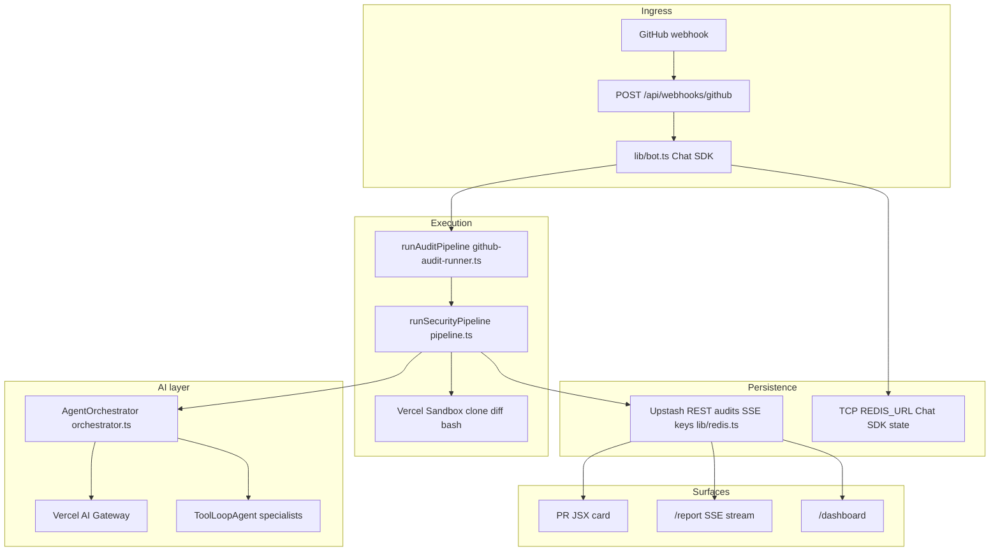
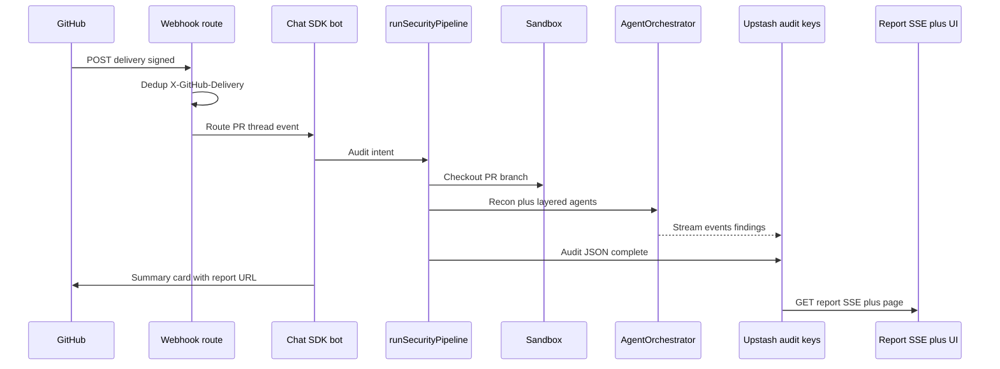
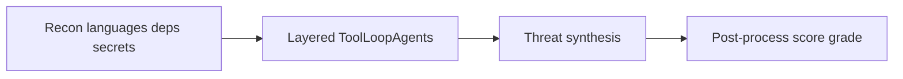
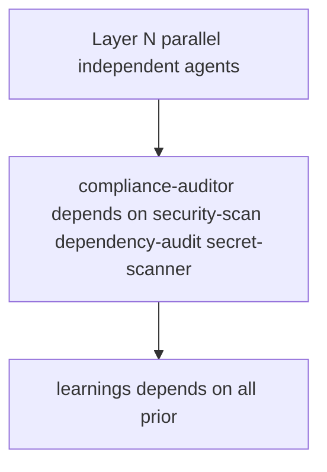

<h1 align="center">ClawGuard</h1>

<p align="center">
  <strong>Agentic PR security: sandboxed analysis, multi-agent <code>ToolLoopAgent</code> orchestration, interactive reports, and optional auto-fix commits — one Next.js deployment on Vercel</strong>
</p>

<p align="center">
  
</p>

<p align="center">
  <a href="https://github.com/Julian-AT/clawguard"></a>
  
  
  
  
</p>

## Overview

A GitHub App webhook hits this repo’s Next.js route; the [Chat SDK](https://chat-sdk.dev) GitHub adapter drives the PR thread. Analysis runs in an isolated [Vercel Sandbox](https://vercel.com/docs/vercel-sandbox) (clone, diff, bash, optional Claw tools). [`AgentOrchestrator`](lib/agents/orchestrator.ts) runs registered [Vercel AI SDK](https://ai-sdk.dev) `ToolLoopAgent` specialists in **topological layers** (parallel inside a layer), then threat synthesis and scoring. Structured audits live in **Upstash Redis** (REST); Chat SDK thread state uses **TCP Redis** separately. The bot posts a JSX summary card; users open `/report/[owner]/[repo]/[pr]` for the full UI (Recharts, Mermaid, Shiki, streaming SSE).

## The challenge

Static scanners and linters are fast but often miss cross-file and abuse-path context. Reviews that stop at comments rarely ship patches. ClawGuard targets the gap between **detection** and **remediation**: one path from PR event → stored audit → human-readable report → optional validated fix + commit + re-audit.

## Core capabilities

| Track | What ships |
|-------|------------|
| **MVP** | @mention trigger, recon + layered multi-agent scan, Zod-typed `AuditResult`, interactive report, webhook idempotency |
| **Remediation** | Deterministic `fix.before`/`fix.after`, fallback fix `ToolLoopAgent`, validation gate (tsc/eslint/biome/tests), Octokit commits to PR branch, re-audit |
| **Product** | NextAuth dashboard, org learnings / knowledge injection, post-merge tracking metrics, optional Slack/Teams/Linear routes |
| **Config** | Target-repo `.clawguard/config.yml` + `policies.yml`; defaults in [`lib/config/defaults.ts`](lib/config/defaults.ts) |

Product UI assets live under [`public/`](public/) (same files power the **#features** carousel on the landing page). The interactive report (`/report/[owner]/[repo]/[pr]`) covers verdict, findings-by-severity, PR summary / diagrams, threat model, and compliance mapping — below is a second view (executive report + compliance).

<p align="center">
  
  &nbsp;
  
</p>

---

## Implementation: how it actually works

### System architecture



### End-to-end request flow



The webhook path is not a dumb proxy: deduplication, Chat SDK routing, sandbox lifecycle, Redis-backed progress, and SSE are all first-class.

### Pipeline and agent runtime

Recon → **`AgentOrchestrator.run`** (layered parallel `ToolLoopAgent`s, `PipelineMemory`, stream hooks) → optional PR summary → **`runThreatSynthesis`** → **`postProcessAudit`** (score, grade, compliance tags). Each agent uses `stopWhen: stepCountIs(...)`, structured `Output.object` / Zod schemas, and optional skills from [`lib/skills`](lib/skills).



### Orchestrator: layers and dependencies

[`buildExecutionLayers`](lib/agents/orchestrator.ts) topologically sorts agents by `dependsOn`. Each layer runs with **`Promise.all`**. Example shape: **parallel specialists** → **compliance-auditor** (after core scanners) → **learnings** (after prior agents; may emit `finalFindings` and verdict).



### Specialist agents (registry)

Definitions are side-effect registered from [`lib/agents/definitions/index.ts`](lib/agents/definitions/index.ts); resolution via [`lib/agents/registry.ts`](lib/agents/registry.ts).

| Agent | Role | Definition |
|-------|------|--------------|
| `security-scan` | Principal AppSec on diff, CWE/OWASP, optional fix hints | [`security-scan.ts`](lib/agents/definitions/security-scan.ts) |
| `pentest` | Offensive reasoning, attack surface | [`pentest.ts`](lib/agents/definitions/pentest.ts) |
| `api-security` | HTTP handlers, auth, IDOR, CSRF | [`api-security.ts`](lib/agents/definitions/api-security.ts) |
| `secret-scanner` | Secrets on added lines | [`secret-scanner.ts`](lib/agents/definitions/secret-scanner.ts) |
| `dependency-audit` | npm audit / CVE interpretation | [`dependency-audit.ts`](lib/agents/definitions/dependency-audit.ts) |
| `infrastructure-review` | Docker, K8s, Terraform, CI | [`infrastructure-review.ts`](lib/agents/definitions/infrastructure-review.ts) |
| `compliance-auditor` | Maps findings to PCI/SOC2/HIPAA/NIST/ASVS | [`compliance-auditor.ts`](lib/agents/definitions/compliance-auditor.ts) |
| `code-quality` | AST smells, complexity | [`code-quality.ts`](lib/agents/definitions/code-quality.ts) |
| `architecture` | Coupling, Mermaid from graphs | [`architecture.ts`](lib/agents/definitions/architecture.ts) |
| `test-coverage` | Changed logic vs tests | [`test-coverage.ts`](lib/agents/definitions/test-coverage.ts) |
| `documentation` | Doc gaps, API drift | [`documentation.ts`](lib/agents/definitions/documentation.ts) |
| `performance` | N+1, blocking async | [`performance.ts`](lib/agents/definitions/performance.ts) |
| `pr-summary` | Structured PR narrative | [`pr-summary.ts`](lib/agents/definitions/pr-summary.ts) |
| `learnings` | Verdict, team patterns, `finalFindings` | [`learnings.ts`](lib/agents/definitions/learnings.ts) |

### Auto-fix loop (summary)

Critical/high findings with fix hints → sandbox on PR branch → apply patch or fix agent → validate → Octokit commit → optional `reviewPullRequest` re-run. See [`lib/fix/`](lib/fix/).

---

## Technology stack

| Layer | Choices |
|-------|---------|
| App | Next.js 16 App Router, React 19, TypeScript, [proxy.ts](proxy.ts) + NextAuth |
| AI | `ai@6` `ToolLoopAgent`, Vercel AI Gateway, Zod 4 structured output |
| Bot | `chat` + `@chat-adapter/github`, `@chat-adapter/state-redis` (TCP) |
| Sandbox | `@vercel/sandbox`, `bash-tool` |
| Data | `@upstash/redis` REST for audits; `REDIS_URL` TCP for Chat SDK |
| Report UI | Recharts, Mermaid, Shiki, `react-diff-viewer-continued` |
| Quality | Biome, Vitest |

More: [`.planning/research/STACK.md`](.planning/research/STACK.md), [CLAUDE.md](CLAUDE.md).

## Reliability and safety

- Webhook deduplication via `X-GitHub-Delivery` + Redis SETNX
- Zod at API boundaries; `AuditResultSchema` for stored payloads
- Sandboxed git and commands; partial failure recorded per agent in orchestrator
- Rate limits and cooldowns in audit runner and auto-trigger helpers

## Prerequisites

- Node 20+
- GitHub App → webhook `POST /api/webhooks/github`
- Upstash REST (`KV_*` / `UPSTASH_*` per `.env.example`) for audits
- TCP `REDIS_URL` for Chat SDK state (distinct from Upstash)
- Vercel AI Gateway (OIDC on Vercel; `vercel link` + `vercel env pull` locally)

## Setup

```bash
npm install
cp .env.example .env.local
npm run dev
```

Point the GitHub App webhook at your deployment (or ngrok) with path `/api/webhooks/github`.

## Environment variables

See [`.env.example`](.env.example) for the full list. Highlights:

| Variable | Role |
|----------|------|
| `GITHUB_APP_*`, `GITHUB_WEBHOOK_SECRET`, `GITHUB_BOT_USERNAME` | GitHub App |
| `GITHUB_TOKEN` | Octokit: PRs, commits, sandbox git |
| `KV_REST_API_URL`, `KV_REST_API_TOKEN` (or Upstash names) | Audit + stream storage |
| `REDIS_URL` | Chat SDK adapter |
| `NEXTAUTH_*`, `GITHUB_CLIENT_ID`, `GITHUB_CLIENT_SECRET` | Dashboard OAuth |
| `NEXT_PUBLIC_APP_URL` | Absolute `/report/...` links in comments |

## Scripts

`dev`, `build`, `start`, `lint` / `lint:fix`, `test`, `v0:generate` — see [`package.json`](package.json).

## Project layout

```
app/api/webhooks/github/     # Primary webhook
app/api/report/.../          # Audit JSON + SSE
app/dashboard/               # OAuth, demo, learnings, knowledge, tracking
app/report/.../              # Interactive report
lib/analysis/                # Pipeline, recon, threat synthesis, scoring
lib/agents/                  # Orchestrator, registry, definitions
lib/bot.ts                   # Chat SDK entry, intents
lib/fix/                     # Apply, validate, commit
lib/redis.ts                 # Upstash audit storage
```

Deeper structure: [clawguard-plan.md](clawguard-plan.md).

## Resources

- [Chat SDK](https://chat-sdk.dev/docs)
- [Vercel AI SDK](https://ai-sdk.dev/docs)
- [Vercel Sandbox](https://vercel.com/docs/vercel-sandbox)

## License

MIT — see [LICENSE](LICENSE).

---

<p align="center">
  Built for <strong>OpenClaw Hack_001</strong> — Vienna · OpenClaw &amp; Agents · Cybersecurity
</p>
