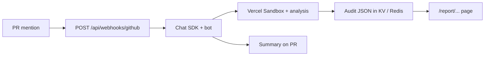

# ClawGuard

AI security reviews for GitHub PRs: mention the bot on a pull request, it runs a multi-phase audit in an isolated sandbox, stores structured results, and posts a summary in the thread with a link to a full interactive report page. Built for OpenClaw Hack_001 — one Next.js app on Vercel, no separate backend.

## How it works

**GitHub.** You configure a GitHub App that points its webhook at this app’s `/api/webhooks/github` route. The [Chat SDK](https://chat-sdk.dev) GitHub adapter handles mention events; the bot runs the security pipeline and replies with a summary card (score, severities, top findings) plus a “view report” link.

**Report.** Each audit is keyed by `owner/repo/pr` and exposed at `/report/[owner]/[repo]/[pr]`. That page reads the stored audit JSON (same shape the bot uses) and renders charts, finding cards, diffs, Mermaid diagrams, and compliance-style tables.

**Dashboard / OAuth.** On the roadmap (see `.planning/ROADMAP.md`): GitHub login and a repo-level overview. Not required to run the bot or the report URL.



## Prerequisites

- **Node** 20+ (Next.js 16)
- **GitHub App** with webhook URL, permissions, and install on the repos you care about
- **Vercel KV (Upstash)** or compatible REST Redis for audit payloads — `KV_REST_*` in `.env.example`
- **TCP Redis** for Chat SDK thread state — `REDIS_URL` (different client than Upstash REST; both are used)
- **Vercel AI Gateway** — OIDC on Vercel; for local dev, use `vercel link` + `vercel env pull` so gateway credentials match your project

Optional: **v0 API key** if you use `npm run v0:generate` for report UI iteration.

## Setup

```bash
npm install
cp .env.example .env.local
# fill in .env.local — see below
npm run dev
```

Point your GitHub App’s webhook at your deployed URL (or a tunnel like ngrok for local dev) + path `/api/webhooks/github`.

## Environment variables

Everything lives in [`.env.example`](.env.example). In short:

- **GitHub App** — `GITHUB_APP_ID`, `GITHUB_PRIVATE_KEY`, `GITHUB_WEBHOOK_SECRET`, `GITHUB_BOT_USERNAME`
- **GitHub token** — `GITHUB_TOKEN` for Octokit (PR metadata, commits, clone auth as configured)
- **Audit storage** — `KV_REST_API_URL` and `KV_REST_API_TOKEN` (Vercel KV / Upstash REST)
- **Chat state** — `REDIS_URL` (TCP) for the Redis-backed Chat SDK adapter

After linking the Vercel project, `vercel env pull` is the least painful way to sync KV and gateway-related vars locally.

## Repo-side config (target repository)

ClawGuard is meant to read optional YAML from the **repository under review**, not from this app’s repo:

- `.clawguard/config.yml` — thresholds, autofix toggles, model hints, ignore paths
- `.clawguard/policies.yml` — extra rules (natural language + severity) merged into the audit

If those files are missing, defaults apply. Details are spelled out in [`clawguard-plan.md`](clawguard-plan.md).

## Project layout

```
app/
  api/report/...          # JSON API for stored audits
  api/webhooks/github/    # GitHub webhook → bot
  report/[owner]/[repo]/[pr]/   # Interactive report page
components/
  report/                 # Report UI (charts, findings, mermaid, diffs)
  ui/                     # shadcn-style primitives
lib/
  analysis/               # Pipeline phases, scoring, types
  fix/                    # Apply / validate / commit / agent helpers
  bot.ts                  # Chat SDK wiring
  redis.ts                # Audit storage helpers
  review.ts               # Review / agent entrypoints
tests/                    # Vitest (bot, webhook, redis, analysis, fix, cards)
```

## Scripts

```json
"dev": "next dev",
"build": "next build",
"start": "next start",
"lint": "biome check",
"lint:fix": "biome check --write",
"format": "biome format --write",
"test": "vitest run",
"test:watch": "vitest",
"v0:generate": "tsx scripts/v0-generate.ts"
```

## Stack

Next.js 16 (App Router), React 19, TypeScript, Tailwind v4, shadcn-style UI, Vercel AI SDK (`ai`), Chat SDK + `@chat-adapter/github` + `@chat-adapter/state-redis`, `@vercel/sandbox`, `@octokit/rest`, `@upstash/redis`, Recharts, Mermaid, Shiki, Zod 4, Vitest.

More background: [`.planning/research/STACK.md`](.planning/research/STACK.md), product notes in [`CLAUDE.md`](CLAUDE.md) (editor/assistant context).
